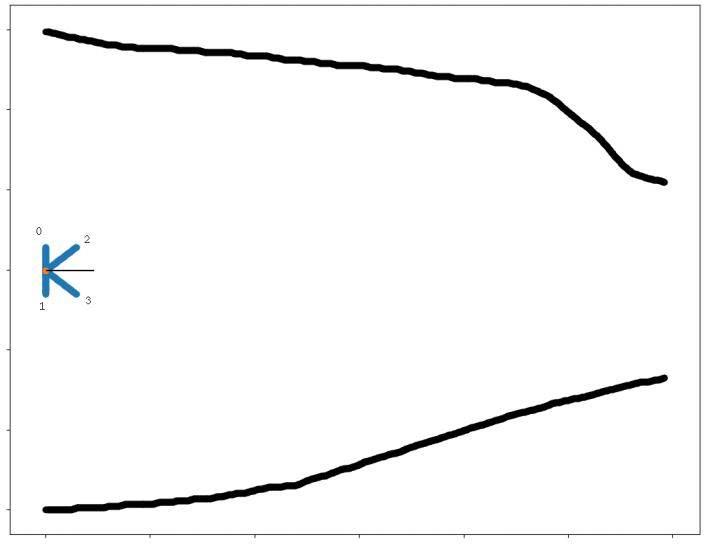

# Racing cars

For your final task, you have to program a car which can maneuver a given track!
How?
You will be given 12 parameters:

## Distance of the car from the current track (4)


The figure contains a sample of the in a track. The black line represents the
current velocity of the car and the distances along with their labels are given
in blue.

## It's velocity
This is a numpy array of size (2,) containing the (x,y) direction of the
velocity vector. We also give you the distances and velocity of one moment in
the past.


## And you are asked to predict it's acceleration for each iteration.
This will be done by writing a python function which takes the distances and
velocity as input and outputs the most appropriate acceleration vector for the car.


# Instructions

## Install the required dependencies by running:
```
pip install -r requirements.txt
```

## Carefully go through the 2 example codes given to understand how to use the given APIs
These are written in ```example_ml.py``` and ```example_simple.py```

### example_simple.py
This contains a simple non-ml example acceleration function. This function just
outputs the acceleration according to the ratio the distance 0 and 3. It
performs quite poorly and often bumps into the tracks.


### example_ml.py
This contains a Genetic Algorithm based ml example function. It attempts to
learn weights associated with each distance vector. This way it improves each
iteration and tries to find the weights such that the car travels furthest to
the right.
As you can see it is a very naive approach. For the task we expect something
like a neural network, trained using GA, which takes the distance vectors as
inputs and outputs the best acceleration vector.


## To create a new track:
Draw a picture of your track (try: pinta on linux / Paint on windows) and run:
```
python3 get_track.py path/to/image path/to/resultfile
```
This will output a csv file which the car class requires.


## "car.py" implements a class Car. It takes 2 arguments - the track path and the acceleration function
The track path can be generated using ```get_track.py```. Try to train your model on
simple paths first. Then gradually moving onto more complicated tracks.


# Submission
-   It is recommended that you create a Jupyter notebook for your final submission
-   You should also save your final ML model and it's weights separately
-   For inspiration you can refer to this youtube video: [Cars learn to drive using neural networks](https://youtu.be/BYR9AJdRR90)

# Objectives
-   Design cars which can efficiently maneuver any given track
-   Maximize the distance traveled by the car
-   Minimize the time taken to reach the finish line
-   And any other objective that you find interesting! (like ensuring that the car moves smoothly)

# Important
-   It is recommended that you use a Machine Learning based solution, but this is not necessary, you can be as creative as you want.
-   If you find any bugs or feel that a feature is missing, feel free to create an issue or submit a pull request on github.
